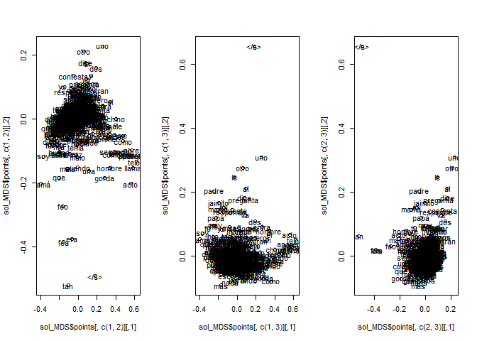

# Primera aproximacion de NLP para el análisis de un conjunto de chistes con título
##  Carga de datos


```r
data_raw=read_csv("data/tots.csv")
```

```
## Rows: 840 Columns: 3
## ── Column specification ────────────────────────────────────────────────────────
## Delimiter: ","
## chr (2): titulo, texto
## dbl (1): id
## 
## ℹ Use `spec()` to retrieve the full column specification for this data.
## ℹ Specify the column types or set `show_col_types = FALSE` to quiet this message.
```

```r
str(data_raw)
```

```
## spec_tbl_df [840 × 3] (S3: spec_tbl_df/tbl_df/tbl/data.frame)
##  $ id    : num [1:840] 1 2 3 4 5 6 7 8 9 10 ...
##  $ titulo: chr [1:840] "Meter la PATA (versión chiste)" "¿Me engañas?" "Quitar el autocorrector" "Sigues siendo" ...
##  $ texto : chr [1:840] "- Que niño tan feo#- Es mi hija...#- Ah! no sabía que fueras padre.#- Soy madre...#- Ah! si! es verdad, si te v"| __truncated__ "–Cariño, ¿me engañas con otra?#–Vale." "–¿¿¿Qué queremos???#–¡¡¡Quitar el autocorrector al movil!!!#–¿¿¿Cuándo lo queremos???#–¡Ahorca!#–¡Ahorro!#–¡Aborda!#–¡Albora!" "– Cariño, está lloviendo y sigues siendo una tonta.#– ¿Qué?#– Me dijiste que con el tiempo cambiarias..." ...
##  - attr(*, "spec")=
##   .. cols(
##   ..   id = col_double(),
##   ..   titulo = col_character(),
##   ..   texto = col_character()
##   .. )
##  - attr(*, "problems")=<externalptr>
```

```r
knitr::kable(head(data_raw,20))
```


| id|titulo                         |texto                                                                                                                                                                               |
|--:|:------------------------------|:-----------------------------------------------------------------------------------------------------------------------------------------------------------------------------------|
|  1|Meter la PATA (versión chiste) |- Que niño tan feo#- Es mi hija...#- Ah! no sabía que fueras padre.#- Soy madre...#- Ah! si! es verdad, si te vi embarazada.#- Es adoptada#- Mejor me voy                           |
|  2|¿Me engañas?                   |–Cariño, ¿me engañas con otra?#–Vale.                                                                                                                                               |
|  3|Quitar el autocorrector        |–¿¿¿Qué queremos???#–¡¡¡Quitar el autocorrector al movil!!!#–¿¿¿Cuándo lo queremos???#–¡Ahorca!#–¡Ahorro!#–¡Aborda!#–¡Albora!                                                       |
|  4|Sigues siendo                  |– Cariño, está lloviendo y sigues siendo una tonta.#– ¿Qué?#– Me dijiste que con el tiempo cambiarias...                                                                            |
|  5|Como un moco                   |La vida es como un moco: intragable, dura y a veces no te deja respirar.                                                                                                            |
|  6|En el bote                     |-No te das cuenta pero ¡TE TENGO EN EL BOTE!#-¡Deja de decir gilipolleces y REMA! ¡Subnormal!                                                                                       |
|  7|El trozo pequeño               |-¿Me das un trozo pequeño de pastel? Pero así, súper chiquitito, que estoy a dieta.#-¿Así? ¿como los otros siete?.#-Sí, porfa                                                       |
|  8|Me siento solo                 |-Me siento solo.#-Yo también, sentarse es fácil.                                                                                                                                    |
|  9|Llamadas del oftalmólogo       |Tengo tres llamadas perdidas de mi oftalmólogo. El de ver me llama...                                                                                                               |
| 10|A la rumana                    |-Camarero, ponga una de calamares a la rumana.#-Perdón, señor, será a la romana.#-Irina, cariño, dile al gilipollas éste de dónde eres...                                           |
| 11|Natural de..                   |- ¿Me pone un zumo de piña?#- ¿Natural…?#- De Pontevedra, pero no creo que eso importe mucho...                                                                                     |
| 12|Signos                         |- ¿De qué signo es tu mujer?#- Debe ser de exclamación, porque se pasa el día gritándome...                                                                                         |
| 13|Capital de España              |- Capital de España?#- La mayor parte en Suiza.                                                                                                                                     |
| 14|Día del abuelo                 |-Papi, ¡feliz día del abuelo!#-Ay hijita pero no tengo ningún nieto.#-¡SORPRESAAA!                                                                                                  |
| 15|Chino                          |-Como se dice en chino marinero pobre?#-Chin chu lancha.                                                                                                                            |
| 16|Manzanas crueles               |Hay un montón de manzanas en un árbol y de repente una se cae. Todas las de arriba empiezan a reírse y a burlarse de la que se ha caído y ésta responde:#- No os riáis, ¡Inmaduras! |
| 17|Qué me das por mi marido       |Dos amigas hablando:#- María, ¿qué me das por mi marido?#- Nada.#- ¡Trato hecho!                                                                                                    |
| 18|El peo viajante                |Primer acto: Un peo volando por Londres.#Segundo acto: El mismo peo volando por Berlín.#Tercer acto: El mismo peo volando por París.#¿Cómo se llama la película?#El europeo.        |
| 19|¿Soy adoptado?                 |- Papá, ¿soy adoptado?#- ¿Tú crees que te habríamos elegido a ti?                                                                                                                   |
| 20|Sujetador a la vista           |- Cariño, se te ve el sujetador.#- Eso no es malo. Hay quien lo enseña adrede.#- Lo que tú digas, pero así no salgo contigo a la calle, Juanjo.                                     |

```r
colnames(data_raw)
```

```
## [1] "id"     "titulo" "texto"
```

```r
text=data_raw$texto
tabla=table(unlist(lapply(text,FUN=function(x) Encoding(x))))
head(text)
```

```
## [1] "- Que niño tan feo#- Es mi hija...#- Ah! no sabía que fueras padre.#- Soy madre...#- Ah! si! es verdad, si te vi embarazada.#- Es adoptada#- Mejor me voy"
## [2] "–Cariño, ¿me engañas con otra?#–Vale."                                                                                                                    
## [3] "–¿¿¿Qué queremos???#–¡¡¡Quitar el autocorrector al movil!!!#–¿¿¿Cuándo lo queremos???#–¡Ahorca!#–¡Ahorro!#–¡Aborda!#–¡Albora!"                            
## [4] "– Cariño, está lloviendo y sigues siendo una tonta.#– ¿Qué?#– Me dijiste que con el tiempo cambiarias..."                                                 
## [5] "La vida es como un moco: intragable, dura y a veces no te deja respirar."                                                                                 
## [6] "-No te das cuenta pero ¡TE TENGO EN EL BOTE!#-¡Deja de decir gilipolleces y REMA! ¡Subnormal!"
```

```r
head(tabla)
```

```
## 
## unknown   UTF-8 
##      62     778
```

```r
library(dplyr)
text_df <- tibble(line = 1:length(text), text_raw =text)%>%
  mutate(Enconding=Encoding(text_raw),text_utf8=enc2utf8(text))
```


## Extracción del diccionario raw empírico desde los chistes

Extraemos al dic_raw_1 todas las palabras que aparecen  con separación   espacio. 

Criterios iniciales:

* Decidimos enconding a UTF-8  columna  text_utf8 si hay que depurar por enconding habrá que ver cómo.
* Hay que decidir qué se hace con los CARACTERES SPECIALES:{,:; () ¿?!!}. De momento los voy a eliminar 
* Todas las MAYÚSCULAS a MINÚSCULAS
* De momento NO SE ELIMINAN DIGITOS: se quedan tal cual, hay que distinguir los de los dígitos de años.
* No catalogamos idiomas....  se supone que todo está en castellano o términos técnicos que añadiremos
* Castellano es toda palabra o   derivado de palabra que se encuentre en un spelling estándar de castellano que podemos ir adaptando.


```r
library(tidytext)
glimpse(text_df)
```

```
## Rows: 840
## Columns: 4
## $ line      <int> 1, 2, 3, 4, 5, 6, 7, 8, 9, 10, 11, 12, 13, 14, 15, 16, 17, 1…
## $ text_raw  <chr> "- Que niño tan feo#- Es mi hija...#- Ah! no sabía que fuera…
## $ Enconding <chr> "UTF-8", "UTF-8", "UTF-8", "UTF-8", "unknown", "UTF-8", "UTF…
## $ text_utf8 <chr> "- Que niño tan feo#- Es mi hija...#- Ah! no sabía que fuera…
```

```r
text_raw=text_df %>% unnest_tokens(word, text_utf8)
glimpse(text_raw)
```

```
## Rows: 20,254
## Columns: 4
## $ line      <int> 1, 1, 1, 1, 1, 1, 1, 1, 1, 1, 1, 1, 1, 1, 1, 1, 1, 1, 1, 1, …
## $ text_raw  <chr> "- Que niño tan feo#- Es mi hija...#- Ah! no sabía que fuera…
## $ Enconding <chr> "UTF-8", "UTF-8", "UTF-8", "UTF-8", "UTF-8", "UTF-8", "UTF-8…
## $ word      <chr> "que", "niño", "tan", "feo", "es", "mi", "hija", "ah", "no",…
```

```r
knitr::kable(head(text_raw,20))
```


| line|text_raw                                                                                                                                                  |Enconding |word   |
|----:|:---------------------------------------------------------------------------------------------------------------------------------------------------------|:---------|:------|
|    1|- Que niño tan feo#- Es mi hija...#- Ah! no sabía que fueras padre.#- Soy madre...#- Ah! si! es verdad, si te vi embarazada.#- Es adoptada#- Mejor me voy |UTF-8     |que    |
|    1|- Que niño tan feo#- Es mi hija...#- Ah! no sabía que fueras padre.#- Soy madre...#- Ah! si! es verdad, si te vi embarazada.#- Es adoptada#- Mejor me voy |UTF-8     |niño   |
|    1|- Que niño tan feo#- Es mi hija...#- Ah! no sabía que fueras padre.#- Soy madre...#- Ah! si! es verdad, si te vi embarazada.#- Es adoptada#- Mejor me voy |UTF-8     |tan    |
|    1|- Que niño tan feo#- Es mi hija...#- Ah! no sabía que fueras padre.#- Soy madre...#- Ah! si! es verdad, si te vi embarazada.#- Es adoptada#- Mejor me voy |UTF-8     |feo    |
|    1|- Que niño tan feo#- Es mi hija...#- Ah! no sabía que fueras padre.#- Soy madre...#- Ah! si! es verdad, si te vi embarazada.#- Es adoptada#- Mejor me voy |UTF-8     |es     |
|    1|- Que niño tan feo#- Es mi hija...#- Ah! no sabía que fueras padre.#- Soy madre...#- Ah! si! es verdad, si te vi embarazada.#- Es adoptada#- Mejor me voy |UTF-8     |mi     |
|    1|- Que niño tan feo#- Es mi hija...#- Ah! no sabía que fueras padre.#- Soy madre...#- Ah! si! es verdad, si te vi embarazada.#- Es adoptada#- Mejor me voy |UTF-8     |hija   |
|    1|- Que niño tan feo#- Es mi hija...#- Ah! no sabía que fueras padre.#- Soy madre...#- Ah! si! es verdad, si te vi embarazada.#- Es adoptada#- Mejor me voy |UTF-8     |ah     |
|    1|- Que niño tan feo#- Es mi hija...#- Ah! no sabía que fueras padre.#- Soy madre...#- Ah! si! es verdad, si te vi embarazada.#- Es adoptada#- Mejor me voy |UTF-8     |no     |
|    1|- Que niño tan feo#- Es mi hija...#- Ah! no sabía que fueras padre.#- Soy madre...#- Ah! si! es verdad, si te vi embarazada.#- Es adoptada#- Mejor me voy |UTF-8     |sabía  |
|    1|- Que niño tan feo#- Es mi hija...#- Ah! no sabía que fueras padre.#- Soy madre...#- Ah! si! es verdad, si te vi embarazada.#- Es adoptada#- Mejor me voy |UTF-8     |que    |
|    1|- Que niño tan feo#- Es mi hija...#- Ah! no sabía que fueras padre.#- Soy madre...#- Ah! si! es verdad, si te vi embarazada.#- Es adoptada#- Mejor me voy |UTF-8     |fueras |
|    1|- Que niño tan feo#- Es mi hija...#- Ah! no sabía que fueras padre.#- Soy madre...#- Ah! si! es verdad, si te vi embarazada.#- Es adoptada#- Mejor me voy |UTF-8     |padre  |
|    1|- Que niño tan feo#- Es mi hija...#- Ah! no sabía que fueras padre.#- Soy madre...#- Ah! si! es verdad, si te vi embarazada.#- Es adoptada#- Mejor me voy |UTF-8     |soy    |
|    1|- Que niño tan feo#- Es mi hija...#- Ah! no sabía que fueras padre.#- Soy madre...#- Ah! si! es verdad, si te vi embarazada.#- Es adoptada#- Mejor me voy |UTF-8     |madre  |
|    1|- Que niño tan feo#- Es mi hija...#- Ah! no sabía que fueras padre.#- Soy madre...#- Ah! si! es verdad, si te vi embarazada.#- Es adoptada#- Mejor me voy |UTF-8     |ah     |
|    1|- Que niño tan feo#- Es mi hija...#- Ah! no sabía que fueras padre.#- Soy madre...#- Ah! si! es verdad, si te vi embarazada.#- Es adoptada#- Mejor me voy |UTF-8     |si     |
|    1|- Que niño tan feo#- Es mi hija...#- Ah! no sabía que fueras padre.#- Soy madre...#- Ah! si! es verdad, si te vi embarazada.#- Es adoptada#- Mejor me voy |UTF-8     |es     |
|    1|- Que niño tan feo#- Es mi hija...#- Ah! no sabía que fueras padre.#- Soy madre...#- Ah! si! es verdad, si te vi embarazada.#- Es adoptada#- Mejor me voy |UTF-8     |verdad |
|    1|- Que niño tan feo#- Es mi hija...#- Ah! no sabía que fueras padre.#- Soy madre...#- Ah! si! es verdad, si te vi embarazada.#- Es adoptada#- Mejor me voy |UTF-8     |si     |

```r
dic_raw_1=sort(unique(text_raw$word))
nw=length(dic_raw_1)# Hay 1627 palabras
nw
```

```
## [1] 3948
```

## Construcción del modelo de diccionario

Construiremos una tabla de modelado del corpus de palabras de los chistes:

* Como primary key la word ( las `nw` words) (desde el text_raw en utf8)
* Su frecuencia: número de veces que  aparece en los  diagnósticos
* Si es correcta  según un spelling de español  de España (hay que buscar... qué hay mejor)


```r
count_freq=text_raw %>% group_by(word) %>% summarise(N=n())

dic_raw_1 = tibble(word=dic_raw_1) %>% left_join(count_freq,by="word")
```


Ahora vemos claramente cómo podemos mejorar las words para UNIFICARLAS en un único "léxico" que nos permita un tratamiento unificado, auqnue las variantes escritas podrían tener significado humorístico.

Ejemplos


Palabras que contienen "zq"


```r
dic_raw_1[grep("zq",dic_raw_1$word),]
```

```
## # A tibble: 2 × 2
##   word          N
##   <chr>     <int>
## 1 izquierda     2
## 2 izquierdo     1
```


Palabras que  contienen "ch"


```r
dic_raw_1[grep("(ch)",dic_raw_1$word),]
```

```
## # A tibble: 109 × 2
##    word           N
##    <chr>      <int>
##  1 agaché         1
##  2 ancho          1
##  3 anchoas        1
##  4 anoche         4
##  5 aprovecha      1
##  6 baches         1
##  7 bachiller      1
##  8 borracho      13
##  9 borrachos      4
## 10 cachichien     1
## # … with 99 more rows
```


Palabras (dos palabras) con :


```r
dic_raw_1[grep(":",dic_raw_1$word),]
```

```
## # A tibble: 3 × 2
##   word          N
##   <chr>     <int>
## 1 1acto:un      1
## 2 2acto:una     1
## 3 3acto:el      1
```
### Añadimos columna  de spelling al diccionario


Primero veamos algunos ejemplos de las sugerencias: ver manual en de  [hunspell](https://docs.ropensci.org/hunspell/articles/intro.html).
[Github diccionarios open office](https://github.com/LibreOffice/dictionaries)


```r
library("spelling")
library("hunspell")
#https://github.com/titoBouzout/Dictionaries # do
#es=dictionary(lang = "diccionarios/es_ES.dic", affix = "diccionarios/es_ES.dic", add_words = NULL,  cache = FALSE)
es_ES<- dictionary("diccionarios/es_ES.dic")
#print(es_ES)
list_dictionaries()# estos son los que  vienen por defecto
```

```
## [1] "en_AU" "en_CA" "en_GB" "en_US"
```

```r
hunspell_check(c("bieja","colon","colón"),dic= es_ES)
```

```
## [1] FALSE  TRUE FALSE
```

```r
hunspell_suggest(c("bieja","colon","colón"),dic=es_ES)
```

```
## [[1]]
## [1] "vieja" "biela"
## 
## [[2]]
## [1] "colon"  "clono"  "colo"   "colona" "colono" "colan"  "colen"  "color" 
## 
## [[3]]
## [1] "colon" "clonó" "coló"  "colan" "colen"
```

```r
palabras=c("amor", "amoroso", "amorosamente", "amado", "amante", "amador")
hunspell_analyze(palabras,dic=es_ES)
```

```
## [[1]]
## [1] " st:amor"      "a st:mor fl:a"
## 
## [[2]]
## [1] "a st:moroso fl:a"
## 
## [[3]]
## [1] "a st:morosamente fl:a"
## 
## [[4]]
## [1] " st:amar fl:D"
## 
## [[5]]
## [1] " st:amante"       " st:amantar fl:E"
## 
## [[6]]
## [1] " st:amador"      "a st:mador fl:a"
```

de momento tomaremos  sólo la primera sugerencia, aunque guardaremos todas.


```r
list_sugerences= sapply(dic_raw_1$word, FUN=function(x) hunspell_suggest(x,dic=es_ES))


dic_raw_1$list_sugerence_first=sapply(list_sugerences, FUN=function(x) x[1])
dic_raw_1$list_sugerence_all=sapply(list_sugerences,
                                          FUN=function(x){
                                            if(length(x)>=1) {return(paste(x,collapse=","))}
                                            if(length(x)==0){return(NA)}
                                            })
glimpse(dic_raw_1)
```

```
## Rows: 3,948
## Columns: 4
## $ word                 <chr> "0", "1", "10", "100", "1000", "12", "120", "14",…
## $ N                    <int> 2, 9, 5, 4, 2, 2, 1, 1, 3, 1, 4, 3, 1, 2, 17, 1, …
## $ list_sugerence_first <chr> "a", "a", NA, NA, NA, NA, NA, NA, NA, NA, NA, NA,…
## $ list_sugerence_all   <chr> "a,e,o,d,u,y", "a,e,o,d,u,y", NA, NA, NA, NA, NA,…
```


# Primer modelo de curado de los chistes


```r
knitr::kable(head(dic_raw_1,20))
```


|word     |  N|list_sugerence_first |list_sugerence_all      |
|:--------|--:|:--------------------|:-----------------------|
|0        |  2|a                    |a,e,o,d,u,y             |
|1        |  9|a                    |a,e,o,d,u,y             |
|10       |  5|NA                   |NA                      |
|100      |  4|NA                   |NA                      |
|1000     |  2|NA                   |NA                      |
|12       |  2|NA                   |NA                      |
|120      |  1|NA                   |NA                      |
|14       |  1|NA                   |NA                      |
|15       |  3|NA                   |NA                      |
|16       |  1|NA                   |NA                      |
|17       |  4|NA                   |NA                      |
|18       |  3|NA                   |NA                      |
|1acto:un |  1|tractoran            |tractoran               |
|1er      |  2|ser                  |ser,ter,fer,ver,her,ere |
|2        | 17|a                    |a,e,o,d,u,y             |
|2,10     |  1|NA                   |NA                      |
|20       |  5|NA                   |NA                      |
|2012     |  1|NA                   |NA                      |
|2013     |  1|NA                   |NA                      |
|21       |  1|NA                   |NA                      |


### Salvar en excel 


```r
write_excel_csv2(x=dic_raw_1,file="data/dic_raw_1_chistes.csv")
```


```r
dic_raw_1_long_chistes= dic_raw_1 %>% right_join(text_raw,by="word")
write_excel_csv2(x=dic_raw_1_long_chistes,file="data/dic_raw_1_2_long_chistes.csv")
```


## Siguiente paso tratamiento de los datos curados y generación de las Document Term Matrix


Primera aproximación generación dela DTM del corpus de peticiones curadas. Cruzar estos datos con los tópicos/key words de losa chistes.
Podéis hacerlo con tidytext o con tm (o con quanteda).


# Word to vect


https://github.com/bnosac/word2vec


```r
#install.packages("devtools","Rtools")
#install.packages("word2vec")

library(word2vec)
txt_clean=txt_clean_word2vec(x=text_df$text_utf8, ascii = FALSE, alpha = TRUE, tolower = TRUE, trim = TRUE)
str(txt_clean)
```

```
##  chr [1:840] "que niño tan feo es mi hija ah no sabía que fueras padre soy madre ah si es verdad si te vi embarazada es adopt"| __truncated__ ...
```

```r
model=word2vec(x=txt_clean,
  type = "skip-gram",
  dim = 50,
  window = 10,
  iter = 5L,
  lr = 0.05,
  hs = FALSE,
  negative = 5L,
  sample = 0.001,
  min_count = 5L,
  split = c(" \n,.-!?:;/\"#$%&'()*+<=>@[]\\^_`{|}~\t\v\f\r", ".\n?!"),
  stopwords = character(),
  threads = 1L,
  encoding = "UTF-8"
)
```


```r
embeding=as.matrix(model)
emb <- predict(model, c("autobus", "jaimito", "mujer"), type = "embedding")
emb
```

```
##               [,1]      [,2]     [,3]       [,4]       [,5]     [,6]
## autobus         NA        NA       NA         NA         NA       NA
## jaimito -0.9029428 0.4456650 2.291424 -0.2603077 -0.8651595 1.159386
## mujer   -1.2262290 0.3149043 1.524093 -0.1580837 -1.2351160 1.350751
##                 [,7]        [,8]     [,9]     [,10]     [,11]      [,12]
## autobus           NA          NA       NA        NA        NA         NA
## jaimito -0.005767321  0.02663305 2.201063 0.6793149 0.7983067 -0.3011252
## mujer   -0.564645529 -0.19782393 1.742641 0.7012722 1.1875323 -1.1198293
##              [,13]      [,14]      [,15]    [,16]      [,17]      [,18]
## autobus         NA         NA         NA       NA         NA         NA
## jaimito 0.34974390 -0.5375016 -0.3346774 2.630517 -0.8629485 -0.7553893
## mujer   0.01602611 -0.4523207 -0.8197756 2.591191 -1.0967648 -0.6529631
##               [,19]    [,20]     [,21]      [,22]     [,23]    [,24]      [,25]
## autobus          NA       NA        NA         NA        NA       NA         NA
## jaimito -0.19356616 1.587130 0.0834218 -0.1330000 0.2275137 1.453829 0.08574708
## mujer   -0.07951026 1.882464 0.7014284  0.5493585 0.6793967 1.632300 0.02223906
##              [,26]     [,27]      [,28]     [,29]      [,30]    [,31]     [,32]
## autobus         NA        NA         NA        NA         NA       NA        NA
## jaimito -1.2666415 0.3562700  0.0358367 -1.964876 -0.4468780 1.590638 0.7034245
## mujer   -0.6826162 0.2704859 -0.2091831 -2.173488 -0.2512293 1.567542 0.3224208
##              [,33]      [,34]    [,35]     [,36]       [,37]     [,38]
## autobus         NA         NA       NA        NA          NA        NA
## jaimito -1.7282032 -0.8742278 1.008877 0.8985078  0.20029181 0.1630251
## mujer   -0.9979445 -0.4505752 1.086036 0.1582110 -0.09847366 0.2018503
##              [,39]    [,40]       [,41]       [,42]      [,43]      [,44]
## autobus         NA       NA          NA          NA         NA         NA
## jaimito  0.1409965 1.154895 -0.08142725  0.35595834 -0.9084077 0.08904029
## mujer   -0.2768294 1.013041 -0.04771569 -0.03970559 -0.8765620 0.47845748
##            [,45]      [,46]      [,47]     [,48]     [,49]    [,50]
## autobus       NA         NA         NA        NA        NA       NA
## jaimito 1.137251 0.37176958 -0.1423198 0.6972670 0.7165678 1.672069
## mujer   1.374640 0.09557535 -1.0400599 0.3891621 0.6194687 1.858250
```

```r
nn  <- predict(model, c("jaimito", "profesor"), type = "nearest", top_n = 5)
nn
```

```
## $jaimito
##     term1 term2 similarity rank
## 1 jaimito padre  0.9872203    1
## 2 jaimito    su  0.9850224    2
## 3 jaimito    he  0.9847614    3
## 4 jaimito   muy  0.9846219    4
## 5 jaimito  papá  0.9837278    5
## 
## $profesor
##      term1   term2 similarity rank
## 1 profesor ventana  0.9989839    1
## 2 profesor   donde  0.9989315    2
## 3 profesor    diga  0.9988849    3
## 4 profesor    cara  0.9988254    4
## 5 profesor palabra  0.9987975    5
```


```r
doc2vec(model,c("padre","madre","hijo"))
```

```
##            [,1]      [,2]     [,3]       [,4]       [,5]      [,6]        [,7]
## [1,] -0.5026938 0.6752433 2.212710 -0.1657951 -0.5448253 0.7623365  0.19797418
## [2,] -1.0343870 0.6319334 1.680545 -0.1843577 -1.0470995 1.0866001 -0.09351465
## [3,] -1.1006722 1.1274028 1.739967 -0.1532273 -1.1541589 1.1497059  0.23804795
##           [,8]     [,9]     [,10]     [,11]      [,12]       [,13]      [,14]
## [1,] 0.3009826 2.286214 0.2260250 0.7272006 -0.1150289  0.03563861 -0.7114138
## [2,] 0.1485556 2.130705 0.4385252 0.9046701 -0.8189801 -0.12439570 -0.4253389
## [3,] 0.5011489 2.243020 0.1877463 0.5410442 -0.4644200 -0.24994155 -0.5077615
##           [,15]    [,16]      [,17]      [,18]      [,19]    [,20]      [,21]
## [1,] -0.2808935 2.349036 -0.8747784 -0.3634567 -0.4681685 1.775050 0.07040748
## [2,] -0.5700593 2.515775 -0.9633228 -0.5398069 -0.3369198 1.709371 0.47642826
## [3,] -0.5754618 2.323186 -0.8299130 -0.4283560 -0.2876969 1.544440 0.02073098
##          [,22]     [,23]    [,24]       [,25]     [,26]     [,27]     [,28]
## [1,] 0.1347359 0.3006975 1.427595  0.08826053 -1.486295 0.4751431 -0.181795
## [2,] 0.3996974 0.5320150 1.987409 -0.05802531 -1.082388 0.5382907 -0.147215
## [3,] 0.4237788 0.6459813 2.001412 -0.15345611 -1.082534 0.6741445 -0.016550
##          [,29]      [,30]    [,31]     [,32]     [,33]      [,34]     [,35]
## [1,] -1.944806 -0.4103525 1.448420 0.7882514 -1.914813 -0.7659292 0.8477810
## [2,] -2.159132 -0.2773124 1.496092 0.6281519 -1.543193 -0.4536890 0.8182724
## [3,] -1.831823 -0.4107513 1.390755 1.0236503 -1.844195 -0.4630852 0.6414988
##          [,36]       [,37]      [,38]       [,39]    [,40]        [,41]
## [1,] 1.0580315  0.08886671 0.10671029 -0.04913963 1.568109  0.005125502
## [2,] 0.3977404 -0.16040087 0.32075227 -0.17678486 1.175108 -0.123974447
## [3,] 0.5855531 -0.29267085 0.08706486 -0.09926439 1.114500 -0.306623019
##           [,42]      [,43]       [,44]    [,45]     [,46]      [,47]     [,48]
## [1,] 0.63411340 -0.8292958 -0.28382413 1.413415 0.7899629 -0.1813314 0.2724035
## [2,] 0.08463183 -0.8033109  0.10722068 1.345777 0.4764818 -0.7395975 0.3494545
## [3,] 0.35740916 -0.6807500 -0.03434319 1.261663 0.6464708 -0.4305407 0.3527895
##          [,49]    [,50]
## [1,] 0.7938838 1.664281
## [2,] 0.7605768 1.907729
## [3,] 0.8058123 2.100292
```


```r
M=as.matrix(model)
dim(M)
```

```
## [1] 495  50
```

```r
#Simi=word2vec_similarity(M,M,top_n=+Inf, type="cosine")
cosine <- function(x,y) sum(x * y)/sqrt(sum(x^2)*sum(y^2))
# install.packages("proxy")
library(proxy)
```

```
## 
## Attaching package: 'proxy'
```

```
## The following objects are masked from 'package:stats':
## 
##     as.dist, dist
```

```
## The following object is masked from 'package:base':
## 
##     as.matrix
```

```r
SS=as.matrix(simil(M,method=cosine))
diag(SS)=1
D=sqrt(1-SS)
dimnames(D)=list(dimnames(M)[[1]],dimnames(M)[[1]])
sol_MDS=cmdscale(D,k = 3,list=TRUE)
str(sol_MDS)
```

```
## List of 5
##  $ points: num [1:495, 1:3] 0.3218 -0.0244 -0.054 -0.0956 0.0541 ...
##   ..- attr(*, "dimnames")=List of 2
##   .. ..$ : chr [1:495] "volando" "pobre" "será" "noticias" ...
##   .. ..$ : NULL
##  $ eig   : NULL
##  $ x     : NULL
##  $ ac    : num 0
##  $ GOF   : num [1:2] 0.836 0.836
```

```r
par(mfrow=c(1,3))
plot(sol_MDS$points[,c(1,2)])
text(sol_MDS$points[,c(1,2)],dimnames(M)[[1]])
plot(sol_MDS$points[,c(1,3)])
text(sol_MDS$points[,c(1,3)],dimnames(M)[[1]])
plot(sol_MDS$points[,c(2,3)])
text(sol_MDS$points[,c(2,3)],dimnames(M)[[1]])
```

<!-- -->

```r
par(mfrow=c(1,1))
```


# Naive bayes
Podéis utilizar algún algoritmo  de naivebayes con los metadatos  de los chistes (fichero que se explica abajo) o con topic models.


## Más chistes con metadatos

En el fichero de este git "chistes_con_metadatos.csv" hay más chistes con dos columnas de metadatos para practicar.
