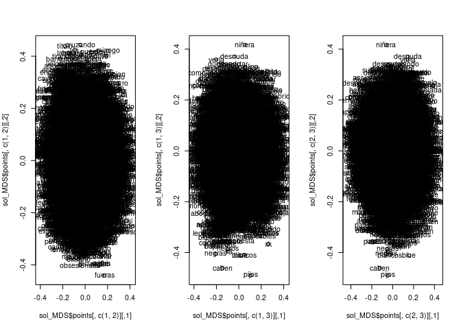

# Análisis de un conjunto de chistes con metadatos 


Algunas ayudas y ejemplos en "Data_model_chistes2.Rmd", se ha cambiado a la libreria "word2vec" más reciente pero menos comentada.

El fichero "data/chistes_con_metadatos_curado.csv"  contiene  unos 7170 chistes de la web [100chistes.com](https://www.1000chistes.com/) y de [pintamania](https://www.pintamania.com/es/chistes).


##  Carga de datos


Los datos están en un fichero separado por ";"  contiene 5 variables 


* origen: la web de origen del chiste; 100 chistes o pintamanía `factor`
* titulo: EL título del chiste `character`.
* categoria: cortos|malos|Jaimito; son  una variable `character`  de categorías separadas por "|"
* palabra_clave: políticos|argentinos; son una una variable `character` de palabras clave separadas por "|"
tags; 
* votos: Número de votos `integer`; solo para pintamania
* texto: tipo character;  es el texto del chiste en UTF-8 separado por "" `character`. 


```r
data_raw=read_csv("data/chistes_con_metadatos_curado.csv",col_names=TRUE)
```

```
## Rows: 7169 Columns: 6
## ── Column specification ────────────────────────────────────────────────────────
## Delimiter: ","
## chr (5): origen, titulo, categorias, palabra_clave, texto
## dbl (1): votos
## 
## ℹ Use `spec()` to retrieve the full column specification for this data.
## ℹ Specify the column types or set `show_col_types = FALSE` to quiet this message.
```

```r
glimpse(data_raw)
```

```
## Rows: 7,169
## Columns: 6
## $ origen        <chr> "1000 chistes", "1000 chistes", "1000 chistes", "1000 ch…
## $ titulo        <chr> "Dime con quién andas...", "Luz automática", "Política a…
## $ categorias    <chr> "cortos|malos", "cortos|malos|borrachos|matrimonios", "c…
## $ palabra_clave <chr> "feos", "neveras", "políticos|argentinos", "sangre", "fu…
## $ votos         <dbl> NA, NA, NA, NA, NA, NA, NA, NA, NA, NA, NA, NA, NA, NA, …
## $ texto         <chr> "- Dime con quién andas y te diré quién eres.  - No ando…
```


```r
knitr::kable(head(data_raw,20))
```


|origen       |titulo                           |categorias                                        |palabra_clave                      | votos|texto                                                                                                                                                                                                                                                                                |
|:------------|:--------------------------------|:-------------------------------------------------|:----------------------------------|-----:|:------------------------------------------------------------------------------------------------------------------------------------------------------------------------------------------------------------------------------------------------------------------------------------|
|1000 chistes |Dime con quién andas...          |cortos&#124;malos                                 |feos                               |    NA|- Dime con quién andas y te diré quién eres.  - No ando con nadie...  - Eres feo.                                                                                                                                                                                                    |
|1000 chistes |Luz automática                   |cortos&#124;malos&#124;borrachos&#124;matrimonios |neveras                            |    NA|Va el marido completamente borracho y le dice a su mujer al irse para cama:  - Me ha pasado algo increíble. He ido al baño y al abrir la puerta se ha encendido la luz automáticamente, sin hacer nada.  - ¡La madre que te parió!, ¡Te mato!, ya te has vuelto a mear en la nevera. |
|1000 chistes |Política argentina               |cortos&#124;malos                                 |políticos&#124;argentinos          |    NA|Un diputado argentino se encuentra en la calle con un amigo de la infancia y éste le pregunta: - ¿Cómo estás llevando esta crisis? - ¡La verdad que duermo como un bebé! - ¡Dormís como un bebé! ¿Pero cómo hacés? - ¡Me despierto cada 3 horas llorando!                            |
|1000 chistes |0 positivo                       |cortos&#124;malos                                 |sangre                             |    NA|- ¡Rápido, necesitamos sangre! - Yo soy 0 positivo. - Pues muy mal, necesitamos una mentalidad optimista.                                                                                                                                                                            |
|1000 chistes |Mejor portero                    |cortos&#124;malos                                 |futbol&#124;porteros               |    NA|- ¿Cuál es el mejor portero del mundial?  - Evidente ¡el de Para-guay!                                                                                                                                                                                                               |
|1000 chistes |Donación para la piscina         |cortos&#124;malos                                 |dinero&#124;agua                   |    NA|El otro día unas chicas llamarón a mi puerta y me pidieron una pequeña donación para una piscina local.  Les di un garrafa de agua.                                                                                                                                                  |
|1000 chistes |Clase de astrología              |cortos&#124;malos&#124;profesores                 |planetas                           |    NA|- Andresito, ¿qué planeta va después de Marte?  - Miércole, señorita.                                                                                                                                                                                                                |
|1000 chistes |Bob Esponja                      |cortos&#124;malos                                 |esponja&#124;gimnasios             |    NA|- ¿Por qué Bob Esponja no va al gimnasio?  - Porque ya está cuadrado.                                                                                                                                                                                                                |
|1000 chistes |Ojalá lloviera                   |cortos&#124;malos                                 |ciegos                             |    NA|Van dos ciegos y le dice uno al otro:  - Ojalá lloviera...  - Ojalá yo también...                                                                                                                                                                                                    |
|1000 chistes |En Canarias                      |cortos&#124;suegras                               |canarias&#124;coches&#124;noticias |    NA|Noticia de última hora!!   Muere una suegra atropellada en Canarias.   Y esto es todo, las 8 en España y UNA menos en Canarias...                                                                                                                                                    |
|1000 chistes |Dicen que estoy loco             |cortos&#124;malos&#124;Jaimito                    |locos&#124;sillas                  |    NA|– Mamá, mamá, en el colegio dicen que estoy loco. – ¿Y quién dice eso de ti? – ...Me lo dicen las sillas...                                                                                                                                                                          |
|1000 chistes |Bocadillo de jamón               |cortos&#124;malos                                 |madres&#124;jamón                  |    NA|– Mamá, mamá, ¿me haces un bocata de jamón? – ¿York? – Sí, túrk.                                                                                                                                                                                                                     |
|1000 chistes |Te echan de varias universidades |malos&#124;cortos                                 |universitarios&#124;universidades  |    NA|- Qué pasa si te expulsan de cuatro univerdades? - .... - Que estás perdiendo facultades                                                                                                                                                                                             |
|1000 chistes |Un pelo en la cama               |cortos&#124;malos                                 |cuentos&#124;pelos                 |    NA|- Qué es un pelo en una cama? - ... - El bello durmiente                                                                                                                                                                                                                             |
|1000 chistes |Entre techos                     |cortos&#124;malos                                 |casas                              |    NA|- Qué le dice el techo del comedor al techo de la cocina? - .... - Te hecho de menos!                                                                                                                                                                                                |
|1000 chistes |Se va la luz                     |cortos&#124;malos                                 |pijos&#124;escuelas                |    NA|- Qué pasa si se va la luz en una escuela privada? - .... - No se ve ni un pijo!                                                                                                                                                                                                     |
|1000 chistes |País sin tacos                   |cortos&#124;malos                                 |país                               |    NA|- En qué se convierte un país en el que se prohíben los tacos? - ....  - En un país destacado!                                                                                                                                                                                       |
|1000 chistes |Messi de aquí a 45 días          |cortos&#124;malos                                 |deportistas&#124;futbol&#124;Messi |    NA|- Qué es Messi en 45 días? - ........ - Mes y medio!                                                                                                                                                                                                                                 |
|1000 chistes |Mundo con forma cubica           |cortos&#124;malos                                 |cubanos&#124;planetas              |    NA|- Qué pasaría si el mundo en lugar de ser una esfera fuera un cubo? - .... - Pues que todos seríamos cubanos                                                                                                                                                                         |
|1000 chistes |Saludable                        |cortos&#124;malos&#124;amigos                     |comidas&#124;deportes              |    NA|- Soy una persona muy saludable. - ¿Haces mucho deporte y comes sano? - No. Es que la gente me saluda por la calle y yo... pues les devuelvo el saludo.                                                                                                                              |


## Extracción del diccionario raw empírico desde los chistes

Extraemos al dic_raw_1 todas las palabras que aparecen  con separación   espacio. 

Criterios iniciales:

* Decidimos enconding a UTF-8  columna  text_utf8 si hay que depurar por enconding habrá que ver cómo.
* Hay que decidir qué se hace con los CARACTERES SPECIALES:{,:; () ¿?!!}. De momento los voy a eliminar 
* Todas las MAYÚSCULAS a MINÚSCULAS
* De momento NO SE ELIMINAN DIGITOS: se quedan tal cual, hay que distinguir los de los dígitos de años.
* No catalogamos idiomas....  se supone que todo está en castellano o términos técnicos que añadiremos
* Castellano es toda palabra o   derivado de palabra que se encuentre en un spelling estándar de castellano que podemos ir adaptando.


```r
library(tidytext)
library(stringr)
texto_df=data_raw
glimpse(texto_df)
```

```
## Rows: 7,169
## Columns: 6
## $ origen        <chr> "1000 chistes", "1000 chistes", "1000 chistes", "1000 ch…
## $ titulo        <chr> "Dime con quién andas...", "Luz automática", "Política a…
## $ categorias    <chr> "cortos|malos", "cortos|malos|borrachos|matrimonios", "c…
## $ palabra_clave <chr> "feos", "neveras", "políticos|argentinos", "sangre", "fu…
## $ votos         <dbl> NA, NA, NA, NA, NA, NA, NA, NA, NA, NA, NA, NA, NA, NA, …
## $ texto         <chr> "- Dime con quién andas y te diré quién eres.  - No ando…
```

```r
#arreglo categorias a columnas distintas se podrían pasar a arrays.
texto_df = texto_df %>% separate(col=c("categorias"),sep="\\|",into=paste0("C",1:5),fill="right")
```

```
## Warning: Expected 5 pieces. Additional pieces discarded in 4 rows [1015, 1039,
## 1529, 1669].
```

```r
texto_df = texto_df %>% separate(col=c("palabra_clave"),sep="\\|",into=paste0("palabra",1:5),fill="right")
```

```
## Warning: Expected 5 pieces. Additional pieces discarded in 10 rows [167, 1587,
## 1589, 1657, 1988, 2072, 2190, 2233, 2363, 2376].
```

```r
texto_df =texto_df %>% mutate(texto_curado=str_squish(str_replace_all(texto, "\\:|-|#|_", " ")))
glimpse(texto_df)
```

```
## Rows: 7,169
## Columns: 15
## $ origen       <chr> "1000 chistes", "1000 chistes", "1000 chistes", "1000 chi…
## $ titulo       <chr> "Dime con quién andas...", "Luz automática", "Política ar…
## $ C1           <chr> "cortos", "cortos", "cortos", "cortos", "cortos", "cortos…
## $ C2           <chr> "malos", "malos", "malos", "malos", "malos", "malos", "ma…
## $ C3           <chr> NA, "borrachos", NA, NA, NA, NA, "profesores", NA, NA, NA…
## $ C4           <chr> NA, "matrimonios", NA, NA, NA, NA, NA, NA, NA, NA, NA, NA…
## $ C5           <chr> NA, NA, NA, NA, NA, NA, NA, NA, NA, NA, NA, NA, NA, NA, N…
## $ palabra1     <chr> "feos", "neveras", "políticos", "sangre", "futbol", "dine…
## $ palabra2     <chr> NA, NA, "argentinos", NA, "porteros", "agua", NA, "gimnas…
## $ palabra3     <chr> NA, NA, NA, NA, NA, NA, NA, NA, NA, "noticias", NA, NA, N…
## $ palabra4     <chr> NA, NA, NA, NA, NA, NA, NA, NA, NA, NA, NA, NA, NA, NA, N…
## $ palabra5     <chr> NA, NA, NA, NA, NA, NA, NA, NA, NA, NA, NA, NA, NA, NA, N…
## $ votos        <dbl> NA, NA, NA, NA, NA, NA, NA, NA, NA, NA, NA, NA, NA, NA, N…
## $ texto        <chr> "- Dime con quién andas y te diré quién eres.  - No ando …
## $ texto_curado <chr> "Dime con quién andas y te diré quién eres. No ando con n…
```

```r
## str_replace_all(text, "\\:|-|#", " ") reemplazo ":" o "-" o "#" por espacio
# esto es necesario para arreglar "hola:Pepe" que quedaría cómo una palabra si elimino:
## str_squish quita espacios  repetidos

texto_tokens=texto_df %>%  unnest_tokens(word, texto_curado)
glimpse(texto_tokens)
```

```
## Rows: 295,503
## Columns: 15
## $ origen   <chr> "1000 chistes", "1000 chistes", "1000 chistes", "1000 chistes…
## $ titulo   <chr> "Dime con quién andas...", "Dime con quién andas...", "Dime c…
## $ C1       <chr> "cortos", "cortos", "cortos", "cortos", "cortos", "cortos", "…
## $ C2       <chr> "malos", "malos", "malos", "malos", "malos", "malos", "malos"…
## $ C3       <chr> NA, NA, NA, NA, NA, NA, NA, NA, NA, NA, NA, NA, NA, NA, NA, "…
## $ C4       <chr> NA, NA, NA, NA, NA, NA, NA, NA, NA, NA, NA, NA, NA, NA, NA, "…
## $ C5       <chr> NA, NA, NA, NA, NA, NA, NA, NA, NA, NA, NA, NA, NA, NA, NA, N…
## $ palabra1 <chr> "feos", "feos", "feos", "feos", "feos", "feos", "feos", "feos…
## $ palabra2 <chr> NA, NA, NA, NA, NA, NA, NA, NA, NA, NA, NA, NA, NA, NA, NA, N…
## $ palabra3 <chr> NA, NA, NA, NA, NA, NA, NA, NA, NA, NA, NA, NA, NA, NA, NA, N…
## $ palabra4 <chr> NA, NA, NA, NA, NA, NA, NA, NA, NA, NA, NA, NA, NA, NA, NA, N…
## $ palabra5 <chr> NA, NA, NA, NA, NA, NA, NA, NA, NA, NA, NA, NA, NA, NA, NA, N…
## $ votos    <dbl> NA, NA, NA, NA, NA, NA, NA, NA, NA, NA, NA, NA, NA, NA, NA, N…
## $ texto    <chr> "- Dime con quién andas y te diré quién eres.  - No ando con …
## $ word     <chr> "dime", "con", "quién", "andas", "y", "te", "diré", "quién", …
```

```r
knitr::kable(head(texto_tokens,20))
```


|origen       |titulo                  |C1     |C2    |C3        |C4          |C5 |palabra1 |palabra2 |palabra3 |palabra4 |palabra5 | votos|texto                                                                                                                                                                                                                                                                                |word          |
|:------------|:-----------------------|:------|:-----|:---------|:-----------|:--|:--------|:--------|:--------|:--------|:--------|-----:|:------------------------------------------------------------------------------------------------------------------------------------------------------------------------------------------------------------------------------------------------------------------------------------|:-------------|
|1000 chistes |Dime con quién andas... |cortos |malos |NA        |NA          |NA |feos     |NA       |NA       |NA       |NA       |    NA|- Dime con quién andas y te diré quién eres.  - No ando con nadie...  - Eres feo.                                                                                                                                                                                                    |dime          |
|1000 chistes |Dime con quién andas... |cortos |malos |NA        |NA          |NA |feos     |NA       |NA       |NA       |NA       |    NA|- Dime con quién andas y te diré quién eres.  - No ando con nadie...  - Eres feo.                                                                                                                                                                                                    |con           |
|1000 chistes |Dime con quién andas... |cortos |malos |NA        |NA          |NA |feos     |NA       |NA       |NA       |NA       |    NA|- Dime con quién andas y te diré quién eres.  - No ando con nadie...  - Eres feo.                                                                                                                                                                                                    |quién         |
|1000 chistes |Dime con quién andas... |cortos |malos |NA        |NA          |NA |feos     |NA       |NA       |NA       |NA       |    NA|- Dime con quién andas y te diré quién eres.  - No ando con nadie...  - Eres feo.                                                                                                                                                                                                    |andas         |
|1000 chistes |Dime con quién andas... |cortos |malos |NA        |NA          |NA |feos     |NA       |NA       |NA       |NA       |    NA|- Dime con quién andas y te diré quién eres.  - No ando con nadie...  - Eres feo.                                                                                                                                                                                                    |y             |
|1000 chistes |Dime con quién andas... |cortos |malos |NA        |NA          |NA |feos     |NA       |NA       |NA       |NA       |    NA|- Dime con quién andas y te diré quién eres.  - No ando con nadie...  - Eres feo.                                                                                                                                                                                                    |te            |
|1000 chistes |Dime con quién andas... |cortos |malos |NA        |NA          |NA |feos     |NA       |NA       |NA       |NA       |    NA|- Dime con quién andas y te diré quién eres.  - No ando con nadie...  - Eres feo.                                                                                                                                                                                                    |diré          |
|1000 chistes |Dime con quién andas... |cortos |malos |NA        |NA          |NA |feos     |NA       |NA       |NA       |NA       |    NA|- Dime con quién andas y te diré quién eres.  - No ando con nadie...  - Eres feo.                                                                                                                                                                                                    |quién         |
|1000 chistes |Dime con quién andas... |cortos |malos |NA        |NA          |NA |feos     |NA       |NA       |NA       |NA       |    NA|- Dime con quién andas y te diré quién eres.  - No ando con nadie...  - Eres feo.                                                                                                                                                                                                    |eres          |
|1000 chistes |Dime con quién andas... |cortos |malos |NA        |NA          |NA |feos     |NA       |NA       |NA       |NA       |    NA|- Dime con quién andas y te diré quién eres.  - No ando con nadie...  - Eres feo.                                                                                                                                                                                                    |no            |
|1000 chistes |Dime con quién andas... |cortos |malos |NA        |NA          |NA |feos     |NA       |NA       |NA       |NA       |    NA|- Dime con quién andas y te diré quién eres.  - No ando con nadie...  - Eres feo.                                                                                                                                                                                                    |ando          |
|1000 chistes |Dime con quién andas... |cortos |malos |NA        |NA          |NA |feos     |NA       |NA       |NA       |NA       |    NA|- Dime con quién andas y te diré quién eres.  - No ando con nadie...  - Eres feo.                                                                                                                                                                                                    |con           |
|1000 chistes |Dime con quién andas... |cortos |malos |NA        |NA          |NA |feos     |NA       |NA       |NA       |NA       |    NA|- Dime con quién andas y te diré quién eres.  - No ando con nadie...  - Eres feo.                                                                                                                                                                                                    |nadie         |
|1000 chistes |Dime con quién andas... |cortos |malos |NA        |NA          |NA |feos     |NA       |NA       |NA       |NA       |    NA|- Dime con quién andas y te diré quién eres.  - No ando con nadie...  - Eres feo.                                                                                                                                                                                                    |eres          |
|1000 chistes |Dime con quién andas... |cortos |malos |NA        |NA          |NA |feos     |NA       |NA       |NA       |NA       |    NA|- Dime con quién andas y te diré quién eres.  - No ando con nadie...  - Eres feo.                                                                                                                                                                                                    |feo           |
|1000 chistes |Luz automática          |cortos |malos |borrachos |matrimonios |NA |neveras  |NA       |NA       |NA       |NA       |    NA|Va el marido completamente borracho y le dice a su mujer al irse para cama:  - Me ha pasado algo increíble. He ido al baño y al abrir la puerta se ha encendido la luz automáticamente, sin hacer nada.  - ¡La madre que te parió!, ¡Te mato!, ya te has vuelto a mear en la nevera. |va            |
|1000 chistes |Luz automática          |cortos |malos |borrachos |matrimonios |NA |neveras  |NA       |NA       |NA       |NA       |    NA|Va el marido completamente borracho y le dice a su mujer al irse para cama:  - Me ha pasado algo increíble. He ido al baño y al abrir la puerta se ha encendido la luz automáticamente, sin hacer nada.  - ¡La madre que te parió!, ¡Te mato!, ya te has vuelto a mear en la nevera. |el            |
|1000 chistes |Luz automática          |cortos |malos |borrachos |matrimonios |NA |neveras  |NA       |NA       |NA       |NA       |    NA|Va el marido completamente borracho y le dice a su mujer al irse para cama:  - Me ha pasado algo increíble. He ido al baño y al abrir la puerta se ha encendido la luz automáticamente, sin hacer nada.  - ¡La madre que te parió!, ¡Te mato!, ya te has vuelto a mear en la nevera. |marido        |
|1000 chistes |Luz automática          |cortos |malos |borrachos |matrimonios |NA |neveras  |NA       |NA       |NA       |NA       |    NA|Va el marido completamente borracho y le dice a su mujer al irse para cama:  - Me ha pasado algo increíble. He ido al baño y al abrir la puerta se ha encendido la luz automáticamente, sin hacer nada.  - ¡La madre que te parió!, ¡Te mato!, ya te has vuelto a mear en la nevera. |completamente |
|1000 chistes |Luz automática          |cortos |malos |borrachos |matrimonios |NA |neveras  |NA       |NA       |NA       |NA       |    NA|Va el marido completamente borracho y le dice a su mujer al irse para cama:  - Me ha pasado algo increíble. He ido al baño y al abrir la puerta se ha encendido la luz automáticamente, sin hacer nada.  - ¡La madre que te parió!, ¡Te mato!, ya te has vuelto a mear en la nevera. |borracho      |

```r
dic_raw_1=sort(unique(texto_tokens$word))
nw=length(dic_raw_1)# 
nw # número de poalbaras distintas
```

```
## [1] 23456
```

## Construcción del modelo de diccionario

Construiremos una tabla de modelado del corpus de palabras de los chistes:

* Como primary key la word ( las `nw` words) (desde el text_raw en utf8)
* Su frecuencia: número de veces que  aparece en los  chistes
* Si es correcta  según un spelling de español  de España (hay que buscar... qué hay mejor)


```r
count_freq=texto_tokens %>% group_by(word) %>% summarise(N=n())
dic_raw_1 = tibble(word=dic_raw_1) %>% left_join(count_freq,by="word")
```


Ahora vemos claramente cómo podemos mejorar las words para UNIFICARLAS en un único "léxico" que nos permita un tratamiento unificado, auqnue las variantes escritas podrían tener significado humorístico.

Ejemplos


Palabras que contienen "zq"


```r
dic_raw_1[grep("zq",dic_raw_1$word),]
```

```
## # A tibble: 4 × 2
##   word          N
##   <chr>     <int>
## 1 izquierda    20
## 2 izquierdo     7
## 3 vazquezy      1
## 4 vezque        1
```


Palabras que  contienen "ch"


```r
dic_raw_1[grep("(ch)",dic_raw_1$word),]
```

```
## # A tibble: 832 × 2
##    word                  N
##    <chr>             <int>
##  1 2ºchiste              1
##  2 abolladuras.dicho     1
##  3 abrochados            1
##  4 acha                  1
##  5 achedo                1
##  6 achica                1
##  7 achííííííííííííís     1
##  8 achillar              1
##  9 achina                1
## 10 achiqué               1
## # … with 822 more rows
```


Palabras (dos palabras) con :


```r
dic_raw_1[grep(":",dic_raw_1$word),]
```

```
## # A tibble: 0 × 2
## # … with 2 variables: word <chr>, N <int>
```
### Añadimos columna  de spelling al diccionario


Primero veamos algunos ejemplos de las sugerencias: ver manual en de  [hunspell](https://docs.ropensci.org/hunspell/articles/intro.html).
[Github diccionarios open office](https://github.com/LibreOffice/dictionaries)


```r
library("spelling")
library("hunspell")
#https://github.com/titoBouzout/Dictionaries # do
#es=dictionary(lang = "diccionarios/es_ES.dic", affix = "diccionarios/es_ES.dic", add_words = NULL,  cache = FALSE)
es_ES<- dictionary("diccionarios/es_ES.dic")
#print(es_ES)
list_dictionaries()# estos son los que  vienen por defecto
```

```
## [1] "en_AU" "en_CA" "en_GB" "en_US"
```

```r
hunspell_check(c("bieja","colon","colón"),dic= es_ES)
```

```
## [1] FALSE  TRUE FALSE
```

```r
hunspell_suggest(c("bieja","colon","colón"),dic=es_ES)
```

```
## [[1]]
## [1] "vieja" "biela"
## 
## [[2]]
## [1] "colon"  "clono"  "colo"   "colona" "colono" "colan"  "colen"  "color" 
## 
## [[3]]
## [1] "colon" "clonó" "coló"  "colan" "colen"
```

```r
palabras=c("amor", "amoroso", "amorosamente", "amado", "amante", "amador")
hunspell_analyze(palabras,dic=es_ES)
```

```
## [[1]]
## [1] " st:amor"      "a st:mor fl:a"
## 
## [[2]]
## [1] "a st:moroso fl:a"
## 
## [[3]]
## [1] "a st:morosamente fl:a"
## 
## [[4]]
## [1] " st:amar fl:D"
## 
## [[5]]
## [1] " st:amante"       " st:amantar fl:E"
## 
## [[6]]
## [1] " st:amador"      "a st:mador fl:a"
```

Eliminaremos las palabras que aprezcan menos de $K_{min}=3$ o $K_{max}=500$ veces y números y  tomaremos la primera sugerencia para las palabras que den incorrectas y solo la primera sugerencia.


```r
K_min=3
K_max=500
dic_raw_1 = dic_raw_1 %>% filter(N>K_min & N<K_max )
dim(dic_raw_1)
```

```
## [1] 5332    2
```

```r
dic_raw_1= dic_raw_1[-grep("\\w*[0-9]+\\w*\\s*",dic_raw_1$word),]
dim(dic_raw_1)
```

```
## [1] 5259    2
```

```r
palabras_incorrectas= sapply(dic_raw_1$word, FUN=function(x) hunspell_check(x,dic=es_ES))
table(palabras_incorrectas)
```

```
## palabras_incorrectas
## FALSE  TRUE 
##  1485  3774
```

```r
lista_sugerencias= sapply(dic_raw_1$word, FUN=function(x) hunspell_suggest(x,dic=es_ES))

# nos quedamos con la primera tanto para correctas como para incorrectas

dic_raw_1$word_curada=sapply(lista_sugerencias, FUN=function(x) x[1])
dic_raw_1$lista_sugerencias=sapply(lista_sugerencias,
                                          FUN=function(x){
                                            if(length(x)>=1) {return(paste(x,collapse=","))}
                                            if(length(x)==0){return(NA)}
                                            })
# eliminamos NA

dic_raw_1 = dic_raw_1[!is.na(dic_raw_1$word_curada),]
dim(dic_raw_1)
```

```
## [1] 5238    4
```


# Primer modelo de curado de los chistes


```r
knitr::kable(head(dic_raw_1,20))
```


|word       |  N|word_curada |lista_sugerencias                                                                    |
|:----------|--:|:-----------|:------------------------------------------------------------------------------------|
|â          |  5|a           |a,e,o,d,u,y                                                                          |
|aa         |  5|as          |as,a,ara,asa,ata,ala,ama,aja,aya,ea,ar,na,ca,ta,al                                   |
|aaa        | 10|asa         |asa,ara,ata,ala,ama,aja,aya,a                                                        |
|aaaa       |  7|bezaar      |bezaar                                                                               |
|abajo      | 76|abajo       |abajo,abajó,bajo,abaja,abaje,abano,abato,atajo,abalo,ahajo,abajá,abajé,a bajo        |
|abanico    |  4|abanico     |abanico,abanicó,abanicos,abanica,abanicá                                             |
|abecedario |  8|abecedario  |abecedario,abecedarios                                                               |
|abeja      |  7|abeja       |abeja,abaje,aneja,abejar,abejas,abaja,aleja                                          |
|aber       | 12|abre        |abre,saber,caber,haber,abey,ayer,aberra,rabera                                       |
|abeto      |  4|abeto       |abeto,aneto,abetos,beato,abato,abete,abito,ateto,aleto                               |
|abia       | 66|abiar       |abiar,rabia,abina,sabia,abita,labia,abra,aria,amia,babi                              |
|abian      | 10|abina       |abina,rabian,abinan,abitan,abiar,abran,babiano                                       |
|abienta    |  8|avienta     |avienta,ablienta,ambienta,abierta,asienta,alienta,habiente,enrabieta,tienta,entablen |
|abierta    |  8|abierta     |abierta,abiertas,rabieta,abierto,acierta                                             |
|abiertas   |  5|abiertas    |abiertas,abierta,rabietas,abiertos,aciertas                                          |
|abierto    |  5|abierto     |abierto,abiertos,abierta,acierto                                                     |
|abiertos   |  4|abiertos    |abiertos,abierto,abiertas,aciertos                                                   |
|abion      |  5|abino       |abino,sabiondo                                                                       |
|abitacion  |  6|habitación |habitación                                                                          |
|abla       |  7|bala        |bala,alba,ala,abala,nabla,tabla,ambla,fabla,habla,abra,arla,aula,aballa              |

```r
texto_tokens= texto_tokens %>% right_join(dic_raw_1,word_curada,by="word")
```


## Siguiente paso tratamiento de los datos curados y generación de las Document Term Matrix


Primera aproximación generación dela DTM del corpus de peticiones curadas. Cruzar estos datos con los tópicos/key words de losa chistes.
Podéis hacerlo con tidytext o con tm (o con quanteda).


```r
library(tm)
library(tidytext)
texto_tokens$N=1
DTM=cast_dtm(texto_tokens,document="titulo",term="word_curada",value=N)
MM=as.matrix(DTM)
titulos=row.names(MM)
MM=as_tibble(MM)
MM$titulo=titulos
```


## Generación de tópicos 4 tópicos


```r
library(topicmodels)
set.seed(22)
chistes_2=LDA(DTM, k=2, method = "Gibbs", control = NULL, model = NULL)

chistes_documentos <- tidy(chistes_2, matrix = "gamma")
chistes_documentos%>% arrange(document) 
```

```
## # A tibble: 11,960 × 3
##    document                       topic gamma
##    <chr>                          <int> <dbl>
##  1 --DAA---NI YO SE                   1 0.508
##  2 --DAA---NI YO SE                   2 0.492
##  3 -¿A TI QUÉ ES LO QUE MÁS TE MO     1 0.419
##  4 -¿A TI QUÉ ES LO QUE MÁS TE MO     2 0.581
##  5 -NO ME CORRIJAS                    1 0.540
##  6 -NO ME CORRIJAS                    2 0.460
##  7 !!QUE LOCO!!                       1 0.45 
##  8 !!QUE LOCO!!                       2 0.55 
##  9 !REPITINEDO TODO!!!!!!             1 0.608
## 10 !REPITINEDO TODO!!!!!!             2 0.392
## # … with 11,950 more rows
```

```r
tabla_topicos =chistes_documentos %>% pivot_wider(id_cols=document, names_from=topic,values_from= gamma) 
names(tabla_topicos)[2:3]=paste0("Topico_",names(tabla_topicos)[2:3])
names(tabla_topicos)
```

```
## [1] "document" "Topico_1" "Topico_2"
```

```r
Topico =apply(tabla_topicos[,2:3],1,
              FUN=function(x) {
                if(x[1]>x[2]){topico=1}
                if(x[1]<x[2]){topico=2}
if(x[1]==x[2]){topico=0}
return(topico)
                })


tabla_topicos = tabla_topicos %>% mutate(Clase=Topico)
tabla_topicos
```

```
## # A tibble: 5,980 × 4
##    document                 Topico_1 Topico_2 Clase
##    <chr>                       <dbl>    <dbl> <dbl>
##  1 Dime con quién andas...     0.561    0.439     1
##  2 Luz automática              0.429    0.571     2
##  3 Política argentina          0.463    0.537     2
##  4 0 positivo                  0.518    0.482     1
##  5 Mejor portero               0.491    0.509     2
##  6 Donación para la piscina    0.492    0.508     2
##  7 Clase de astrología         0.5      0.5       0
##  8 Bob Esponja                 0.526    0.474     1
##  9 Ojalá lloviera              0.491    0.509     2
## 10 En Canarias                 0.483    0.517     2
## # … with 5,970 more rows
```


Podemos extraer también las categoría o palabras clave pero son demasiadas.


```r
C1=texto_df %>% select(titulo, C1)

df= C1 %>% right_join(MM,by="titulo")
names(df)[1:10]
```

```
##  [1] "titulo" "C1"     "dime"   "quien"  "andas"  "eres"   "ando"   "nadie" 
##  [9] "feo"    "marido"
```

```r
library(naivebayes)

set.seed(1)
nrow(df)
```

```
## [1] 7133
```

```r
Ntraining=floor(0.8*nrow(df))
Ntraining
```

```
## [1] 5706
```

```r
Ntesting=nrow(df)-Ntraining
Ntesting
```

```
## [1] 1427
```

```r
training=sample(1:nrow(df),size=Ntraining,replace = FALSE)
testing=setdiff(1:row(df),training)
```

```
## Warning in 1:row(df): numerical expression has 34110006 elements: only the first
## used
```

```r
train_data=df[training,-1]
testing_data=df[testing,-c(1:2)]
```


Quizá demasiadas categorías mejor topic models a 2 , 3 o 4 ,categorías.


# Word to vect NUEVA librería word2vec


https://github.com/bnosac/word2vec


```r
#install.packages("devtools","Rtools")
#install.packages("word2vec")

library(word2vec)
txt_clean=txt_clean_word2vec(x=data_raw$texto, ascii = FALSE, alpha = TRUE, tolower = TRUE, trim = TRUE)
str(txt_clean)
```

```
##  chr [1:7169] "dime con quién andas y te diré quién eres no ando con nadie eres feo" ...
```

```r
model=word2vec(x=txt_clean,
  type = "skip-gram",
  dim = 50,
  window = 10,
  iter = 5L,
  lr = 0.05,
  hs = FALSE,
  negative = 5L,
  sample = 0.001,
  min_count = 5L,
  split = c(" \n,.-!?:;/\"#$%&'()*+<=>@[]\\^_`{|}~\t\v\f\r", ".\n?!"),
  stopwords = character(),
  threads = 1L,
  encoding = "UTF-8"
)
```


```r
embeding=as.matrix(model)
emb <- predict(model, c("autobus", "jaimito", "mujer"), type = "embedding")
emb
```

```
##               [,1]       [,2]       [,3]       [,4]       [,5]       [,6]
## autobus -0.6815377 -0.2097299 -0.4093753 -0.1681740  1.2419049 -0.1470955
## jaimito -0.7137829 -0.3488648  0.3628805 -0.1881406  0.2914426  2.1613524
## mujer   -0.1701221  1.2734882 -1.3792953 -3.1839180 -0.4922172  0.4436051
##              [,7]        [,8]         [,9]     [,10]      [,11]      [,12]
## autobus 0.9316076  0.13934869 -0.209682807 0.4040231  0.4013720 -0.5989690
## jaimito 0.7768700  0.67839450 -0.003112943 0.1394227 -1.0323704  0.2526588
## mujer   0.2638167 -0.02800674 -1.498569250 0.1267324  0.2385291 -1.0602582
##              [,13]      [,14]      [,15]       [,16]      [,17]     [,18]
## autobus -0.2032959  0.5274708 -2.1112537 -1.37154162  0.4450678 2.0595984
## jaimito -0.2659819  0.8859509 -0.3726801  0.30678338  1.3917626 0.4005601
## mujer    0.3672671 -1.3506190 -1.5112903  0.02608163 -0.2957465 0.7816701
##              [,19]       [,20]       [,21]        [,22]      [,23]        [,24]
## autobus -1.4037138  0.31279653 -0.95933282 -1.571362615 -0.4911961 -1.436218739
## jaimito  0.2432873 -0.08731119  0.01879507 -1.848784328 -0.5408819 -2.252166271
## mujer   -1.7292827 -0.66413879 -0.35900486  0.006160589 -0.9850563  0.005181748
##              [,25]      [,26]     [,27]     [,28]      [,29]    [,30]
## autobus -1.0270717  0.5108007 0.4506918 1.2060593 -0.4217517 1.355728
## jaimito -2.3120630 -1.0144885 1.2472243 0.6063333  0.1067423 1.118105
## mujer   -0.4586867  1.1708497 0.4171592 0.1690255 -0.5999305 1.483507
##              [,31]      [,32]      [,33]      [,34]      [,35]     [,36]
## autobus -0.7753211 0.77477151 -0.4606544  0.5267830  0.8262008 1.3192635
## jaimito  0.5993031 0.58982080  0.9607576 -0.5874723 -1.2495393 1.1448702
## mujer    0.2440611 0.04193525 -1.3670596  0.7196181 -0.4776874 0.5073113
##              [,37]     [,38]      [,39]      [,40]      [,41]      [,42]
## autobus -1.7268406 2.0695252 -0.1022079 -0.6726999  0.5449964 -0.1540757
## jaimito -0.5423526 1.7664877  0.3338672  1.6195670  1.3134311  0.1312473
## mujer   -1.4922405 0.2997854 -1.5275296  1.2104112 -0.2442705 -0.7675630
##              [,43]      [,44]      [,45]      [,46]     [,47]        [,48]
## autobus -0.6835987  1.8839900 -0.6332405 0.68020141 -1.439991 -0.875712335
## jaimito -1.0426686 -0.6319764  0.2105815 0.04147299 -1.310925  0.004647947
## mujer   -1.3570192 -0.5174915  0.4469311 0.81929469 -1.181871 -0.865038812
##              [,49]    [,50]
## autobus -0.2608767 1.521963
## jaimito  1.1091053 1.848477
## mujer    0.9183708 1.695097
```

```r
nn  <- predict(model, c("jaimito", "profesor"), type = "nearest", top_n = 5)
nn
```

```
## $jaimito
##     term1    term2 similarity rank
## 1 jaimito  jeimito  0.8775858    1
## 2 jaimito   decime  0.8753702    2
## 3 jaimito cuaderno  0.8731492    3
## 4 jaimito   lleven  0.8723083    4
## 5 jaimito vasulero  0.8700237    5
## 
## $profesor
##      term1      term2 similarity rank
## 1 profesor      verbo  0.8959711    1
## 2 profesor    luisito  0.8915933    2
## 3 profesor      clase  0.8847579    3
## 4 profesor estudiante  0.8802241    4
## 5 profesor  profesora  0.8758391    5
```


```r
doc2vec(model,c("padre","madre","hijo"))
```

```
##            [,1]        [,2]      [,3]       [,4]      [,5]        [,6]
## [1,]  0.7728041 -0.22725424 0.6728272 -1.7210081 0.2815426  0.82871674
## [2,] -0.2426065  0.07033470 0.4885999 -1.6197605 0.2290611  0.30080179
## [3,]  0.2314794 -0.07166382 0.1313461 -0.9587632 2.1336924 -0.09922249
##           [,7]       [,8]       [,9]      [,10]       [,11]      [,12]
## [1,] 0.9260804 -1.1468172  0.0401662  0.0115335 -0.84453313 -0.1161651
## [2,] 1.7199607 -0.4823563  0.2696579  0.3070781 -0.06738643  0.1001317
## [3,] 1.2022021 -0.8897793 -0.3538862 -0.9189044 -0.04629352 -0.3311624
##           [,13]      [,14]     [,15]     [,16]     [,17]     [,18]      [,19]
## [1,] -0.9433477 -0.7334388 -1.685535 0.7399442 0.8317845 1.8195986 -0.0683683
## [2,]  0.1137611 -0.4630539 -1.031798 1.1351943 0.6425083 0.8901126  0.3621027
## [3,] -0.8031117 -0.1740049 -1.704272 0.7961332 0.5229551 1.4616764 -0.1896098
##           [,20]     [,21]     [,22]       [,23]      [,24]     [,25]      [,26]
## [1,]  1.0993236 0.3016450 -1.045059 -0.54316889  0.4139713 -2.775284 -1.3154731
## [2,] -0.9037109 0.1302649 -1.219165  0.09138957 -1.3243551 -2.961093  0.8948307
## [3,] -1.1215319 0.9564978 -1.262161  1.23773379  0.1583816 -2.237606 -1.0236469
##          [,27]     [,28]     [,29]     [,30]      [,31]     [,32]      [,33]
## [1,] 0.3967545 1.0201160 1.0343869 1.5650800 -1.3660480 1.0430448 -0.8442205
## [2,] 0.7778749 0.1216417 1.2578012 1.8859264 -0.2637515 0.4043184  0.3213308
## [3,] 1.7804638 0.7859830 0.7714684 0.9118044 -0.6570686 1.1653393 -0.4706067
##            [,34]      [,35]    [,36]      [,37]    [,38]     [,39]      [,40]
## [1,]  0.08295417 -0.3257950 1.073871  0.5579275 1.028986 1.1119401 -0.7242824
## [2,]  1.05267526 -1.1815575 1.646655 -1.1156869 2.206587 0.4292139  0.2200890
## [3,] -0.32189365 -0.3957852 1.772080 -0.6897716 2.033314 1.2499389  0.2106735
##          [,41]     [,42]      [,43]      [,44]      [,45]       [,46]
## [1,] 1.4862034 1.0876621 -0.5223191  0.6757761 -0.9121169 -0.33499139
## [2,] 0.9693775 1.0240374 -0.8999085 -1.7137342  0.8479164 -0.01593141
## [3,] 0.4217203 0.8784602  0.2635289 -0.5248656  0.1689552  0.07072644
##            [,47]       [,48]      [,49]     [,50]
## [1,]  0.03500558 -0.25624647 -0.4045840 1.7541543
## [2,] -0.90952159 -0.01400123  0.4016502 0.9435625
## [3,] -0.22920157 -0.01722301 -0.4718125 2.1541308
```


```r
M=as.matrix(model)
dim(M)
```

```
## [1] 4375   50
```

```r
#Simi=word2vec_similarity(M,M,top_n=+Inf, type="cosine")
cosine <- function(x,y) sum(x * y)/sqrt(sum(x^2)*sum(y^2))
# install.packages("proxy")
library(proxy)
SS=as.matrix(simil(M,method=cosine))
diag(SS)=1
D=sqrt(1-SS)
dimnames(D)=list(dimnames(M)[[1]],dimnames(M)[[1]])
sol_MDS=cmdscale(D,k = 3,list=TRUE)
str(sol_MDS)
```

```
## List of 5
##  $ points: num [1:4375, 1:3] -0.3483 -0.0125 0.0613 0.1558 0.0527 ...
##   ..- attr(*, "dimnames")=List of 2
##   .. ..$ : chr [1:4375] "usd" "tocas" "ria" "caducado" ...
##   .. ..$ : NULL
##  $ eig   : NULL
##  $ x     : NULL
##  $ ac    : num 0
##  $ GOF   : num [1:2] 0.238 0.238
```

```r
par(mfrow=c(1,3))
plot(sol_MDS$points[,c(1,2)])
text(sol_MDS$points[,c(1,2)],dimnames(M)[[1]])
plot(sol_MDS$points[,c(1,3)])
text(sol_MDS$points[,c(1,3)],dimnames(M)[[1]])
plot(sol_MDS$points[,c(2,3)])
text(sol_MDS$points[,c(2,3)],dimnames(M)[[1]])
```

<!-- -->

```r
par(mfrow=c(1,1))
```


# Naive bayes
Podéis utilizar algún algoritmo  de naivebayes con los metadatos  de los chistes (fichero que se explica abajo) o con topic models.


## Más chistes con metadatos

En el fichero de este git "chistes_con_metadatos.csv" hay más chistes con dos columnas de metadatos para practicar.
